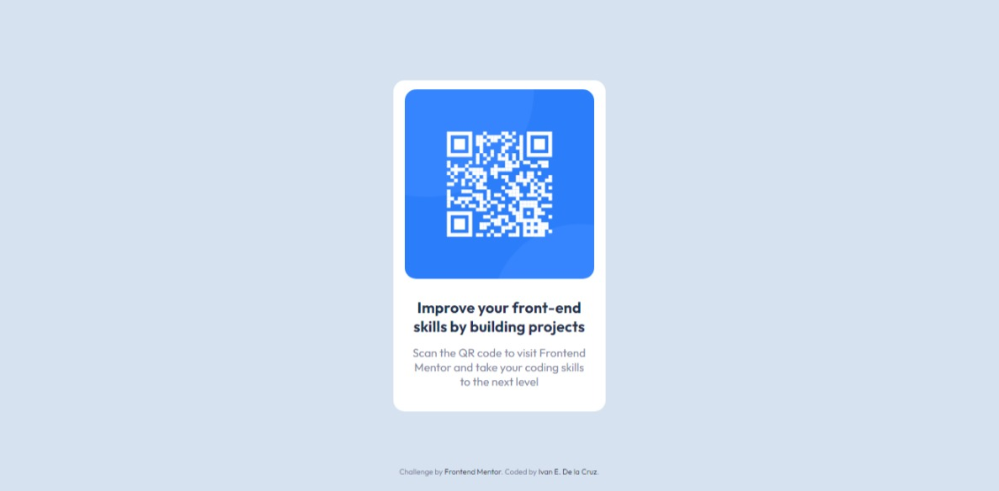

# Frontend Mentor - QR code component solution

This is a solution to the [QR code component challenge on Frontend Mentor](https://www.frontendmentor.io/challenges/qr-code-component-iux_sIO_H). Frontend Mentor challenges help you improve your coding skills by building realistic projects. 

## Table of contents

- [Overview](#overview)
  - [Screenshot](#screenshot)
  - [Links](#links)
- [My process](#my-process)
  - [Built with](#built-with)
  - [What I learned](#what-i-learned)
- [Author](#author)

**Note: Delete this note and update the table of contents based on what sections you keep.**

## Overview

It is a card that contains a QR code to go to the Frontend Mentor website.

### Screenshot

### Links

- Solution URL: [Git Hub](https://github.com/IvanEDLCP/QR-code-component-Frontend-Mentor)
- Live Site URL: [QR Code live site](https://ivanedlcp.github.io/QR-code-component-Frontend-Mentor/)

## My process

### Built with

- Semantic HTML5 markup
- CSS custom properties
- Flexbox
- CSS Grid
- Mobile-first workflow

### What I learned

This is my first Frontend Mentor challenge, it had been a long time since I last wrote css code and this project helped me to review basic structure and concepts of markdown and styles, this is also the first time I write in a Markdown file and I find this kind of documentation interesting, I hope to continue learning and practicing web development in Frontend Mentor.

## Author

- Frontend Mentor - [@IvanEDLCP](https://www.frontendmentor.io/profile/IvanEDLCP)